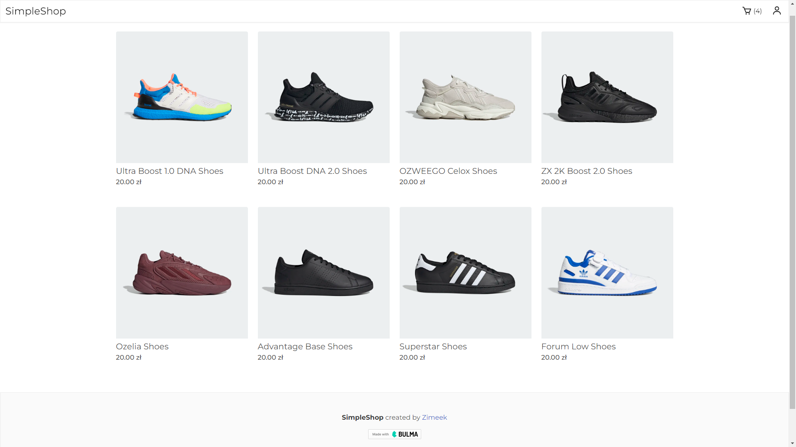
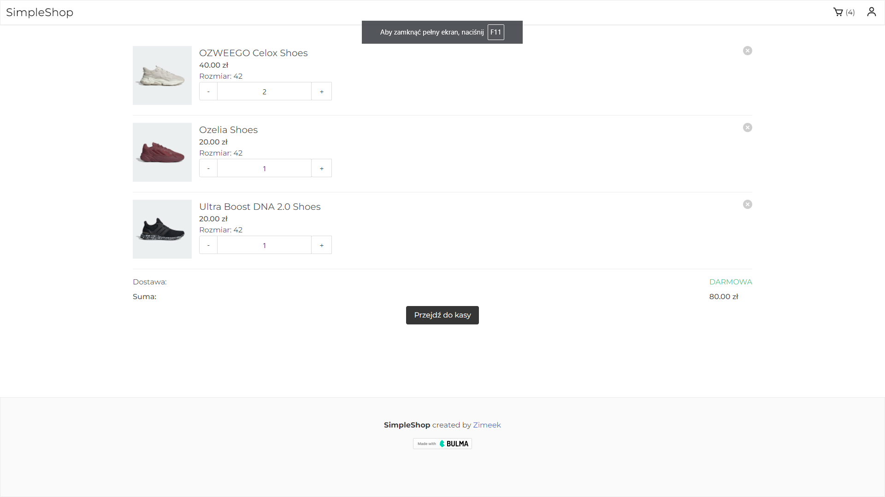
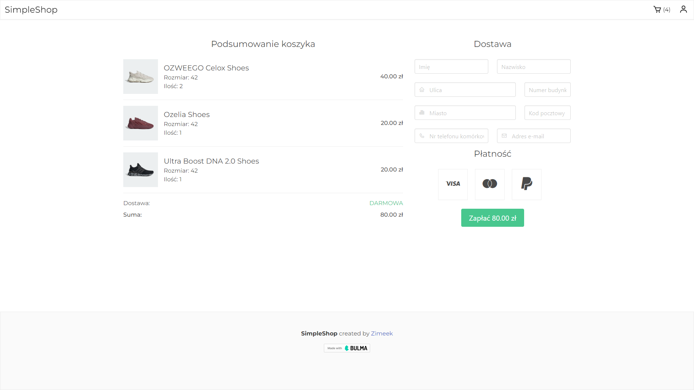

# SimpleShop
Simple but fully functional e-commerce website built with .NET Core 6.


### Technologies used

* ASP.NET Core Razor Pages
* Entity Framework Core 6.0
* MediatR
* Guard Clauses
* Bulma CSS


<!-- GETTING STARTED -->
## Getting Started

This is an example of how you may give instructions on setting up your project locally.
To get a local copy up and running follow these simple example steps.

### Prerequisites

* Visual Studio 2022
* .NET 6

### Installation

1. Configure connection string in appsettings.json (SimpleShop.Web)
2. Clone the repo
   ```sh
   git clone https://github.com/Zimeek/SimpleShop.git
   ```

## Screenshots




